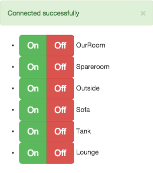

Maplin power socket HTML remote
===============================

Screenshot
----------

Everybody loves screenshots, right?

And yes, this proves my HTML/UI Design skills are as terrible as my JS coding!

Description
-----------

As detailed in [this][bp] blog post, thanks to [Duncan McGregor] reverse engineering the protocol the Maplin remote control uses to control the power sockets I now have a Pi which can toggle my sockets. I hooked my Pi up to my [Mosquitto], [MQTT] broker to listen for events.  

This repo contains the web ui I use to control those sockets. It uses the [paho] Javascript, Websockets MQTT client library which can be found in their GIT repo [here][pahogit], or downloaded directly from [here][pahodirect]. It should be downloaded and put in the same directory on your web server as `index.html` and `config.js`. Other than that it doesn't require any other downloads, although it does use [JQuery] and [Bootstrap], which are both referenced from the [CloudFlare] CDN.

I wrote it to subscribe to a topic defined by the `switchTopic` entry in `config.js` where it expects to receive a JSON object which lists all the rooms. The JSON is very simple and should be published to that topic as a retained message so it is available to any client subscribing to that topic immediately. From this JSON object a list of buttons is created.

When a button is clicked (either on, or off) a JSON object is posted to the topic defined in `toggleTopic`, also in `config.js`. This is in the format expected by [maplin-mqtt.py] which is in my [strogonanoff-switch] GH repo.

update-rooms.sh
---------------

This is a simple bash script which I use to update the configuration of the rooms when I (seldomly) need to. I just edit the JSON and run it on the command line, it publishes a retained message to the `switchTopic` defined in the top of the file (which needs to match the `switchTopic` in `config.js`).  The web ui subscribes to this topic on load and expects to find a retained message with some JSON which describes the channel, button and name of each switch. An example of the JSON is shown in "Example switch config JSON" below.

Example switch action JSON
--------------------------

    {
        "channel": 4,
        "button": 1,
        "action": "on"
    }

Example switch config JSON
--------------------------

    {
        "rooms": [
            {
                "name": "Lounge",
                "channel": 4,
                "button": 1
            },
            {
                "name": "Tank",
                "channel": 4,
                "button": 2
            },
            {
                "name": "Sofa",
                "channel": 4,
                "button": 3
            },
            {
                "name": "Outside",
                "channel": 4,
                "button": 4
            },
            {
                "name": "Spareroom",
                "channel": 3,
                "button": 1
            },
            {
                "name": "OurRoom",
                "channel": 3,
                "button": 2
            }
        ]
    }

License
-------

This project is licensed under a MIT style license with an additional non-advertising clause.  See [LICENSE.md](LICENSE.md) for more information.

[bp]: http://riviera.org.uk/2015/01/15/using-a-raspberry-pi-to-control-maplin-power-sockets/
[Duncan McGregor]: https://github.com/dmcg
[Mosquitto]: http://mosquitto.org/
[MQTT]: http://mqtt.org/
[paho]: https://eclipse.org/paho/clients/js/
[pahogit]: http://git.eclipse.org/c/paho/org.eclipse.paho.mqtt.javascript.git/
[pahodirect]: http://git.eclipse.org/c/paho/org.eclipse.paho.mqtt.javascript.git/plain/src/mqttws31.js
[JQuery]: http://jquery.com/
[Bootstrap]: http://getbootstrap.com/
[CloudFlare]: https://cdnjs.com/
[maplin-mqtt.py]: https://github.com/rk295/strogonanoff-switch/blob/master/maplin-mqtt.py
[strogonanoff-switch]: https://github.com/rk295/strogonanoff-switch
